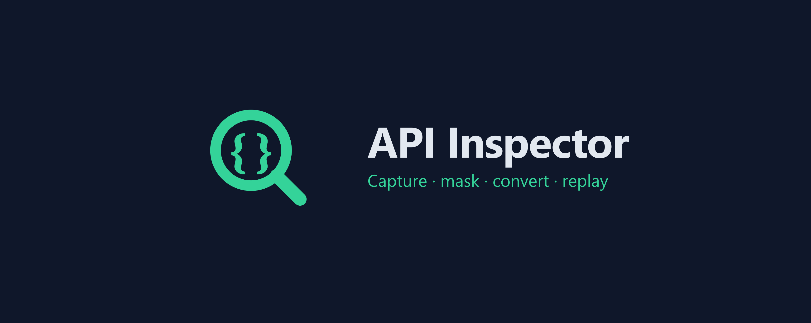

# API Inspector

페이지가 호출하는 API를 잡아 검색·마스킹·변환·재현할 수 있게 바꿔 주는 Chromium(Manifest V3) DevTools 패널 확장입니다. 공식 DevTools API로만 트래픽을 읽기 때문에 네트워크 가로채기도, host 권한도 없으며 요청하는 권한은 `storage` 하나뿐입니다. Network 탭의 "Copy as cURL"에 검색·마스킹·변환·diff·export를 더한 도구라고 보면 됩니다.

영문 문서: [README.md](README.md)

## 기능

수집과 탐색:
- DevTools 패널 — F12 안에 "API Inspector" 탭으로 통합
- 페이지가 보내는 XHR / fetch를 실시간 수집해 가상 스크롤 목록으로 표시
- 필터 — 정규식(URL) · 메서드 · 상태코드 · 정적자원 숨김 · 본문 전문 검색
- JSON 트리뷰 — 요청 / 응답 본문을 접이식 트리로
- 응답 검색 — 응답 본문 정규식 하이라이트

마스킹과 공유:
- 자동 마스킹 — `Authorization` / `Cookie` / `*-token` 헤더와 `token` / `key` / `password` 쿼리 파라미터를 화면·export 모두에서 가림
- 본문 민감정보 마스킹 — 본문·헤더·쿼리 값에서 신용카드 번호(Luhn 검증, 끝 4자리 유지), 이메일, JWT, Bearer 토큰, 주민등록번호를 탐지해 가림
- 플레이스홀더 모드 — 자격증명을 `$AUTH_TOKEN` / `{{AUTH_TOKEN}}` 변수 자리로 출력해, 진짜 토큰 노출 없이도 공유한 명령이 그대로 실행 가능

변환과 문서화:
- 변환 — cURL(멀티라인, multipart/form) · HTTPie · Postman Collection
- 엔드포인트 문서화 — 마크다운 문서 자동 생성
- export / import — Postman Collection · HAR · 세션 JSON(응답 본문까지 인라인 재import) 양방향. 마크다운은 export 전용, import는 HAR / Postman / 세션 JSON을 자동 인식

재현과 테스트:
- 편집 & 재전송 — 캡처한 요청을 편집(메서드 / URL / 헤더 / 바디)하고 `{{변수}}` 치환 후, 보고 있는 페이지의 세션으로 그대로 재전송(추가 권한·CORS 문제 없음). 응답을 원본과 비교
- 변수 — `{{KEY}}` 값을 한 번 정의해두고 재전송 시 재사용
- diff — 두 요청 비교(status / query / 헤더 / 본문)
- 퍼즈 — Intruder 방식: `${}`로 위치 지정 + 페이로드 리스트를 페이지 세션으로 순차 재전송, 결과 표에서 길이 / 상태 이상치 강조 (인가된 워게임 / CTF 전용)

도구:
- 독립 뷰어 — 새 탭에서 DevTools 없이 HAR / 세션 파일을 import해 분석 (실시간 캡처는 DevTools 패널 담당)
- 툴박스 — Base64 / URL / Hex / JWT 인코더·디코더, MD5 / SHA-1 / SHA-256 해시, 캡처된 모든 응답 본문에서 정규식 스캔(예: `flag{...}` 찾기)

## 동작 방식

패널은 DevTools 안에 등록되어 `chrome.devtools.network`의 요청 이벤트를 듣고, 각 HAR 항목을 `CapturedRequest`로 정규화합니다. 응답 본문은 필요할 때 lazy load 합니다. 재전송과 퍼징은 `inspectedWindow.eval`로 페이지 자신의 컨텍스트에서 실행되므로, 요청이 페이지 세션을 그대로 재사용하고 추가 권한이나 CORS 처리가 필요 없습니다.

핵심 로직(`src/core/`) — normalize · mask · filter · convert · diff · HAR · Postman · Markdown — 은 브라우저 API에 의존하지 않는 순수 함수라, 무엇이 가려지는지 검증 가능하고 단위 테스트로 커버됩니다. UI는 React 19 + Zustand에 @tanstack/react-virtual로 가상 스크롤을 적용했고, Vite 6 / CRXJS 2 / Tailwind 4 · TypeScript(strict)로 빌드하며, Vitest로 테스트합니다(컴포넌트 테스트는 `chrome.devtools`를 목으로 둔 jsdom 위에서 실행).

프로젝트 구조:
```
src/
  devtools/      DevTools 패널 등록
  panel/         React 패널 UI (FilterBar / RequestList / DetailPanel / ...)
    store/       Zustand 상태
    hooks/       네트워크 캡처 · 응답 본문 lazy load
  core/          순수 로직 (테스트 대상)
    normalize    HAR -> CapturedRequest
    mask         민감 헤더 / 쿼리 / 본문 마스킹
    filter       필터 엔진
    convert/     cURL / HTTPie / Postman 변환
  types.ts
```

## 보안과 개인정보

마스킹 기능의 핵심 목적은 안전한 공유입니다. DevTools의 "Copy as cURL"은 `Authorization: Bearer ...` 토큰을 그대로 복사합니다 — 그걸 슬랙에 붙이는 순간 자격증명이 유출됩니다. API Inspector는 바로 그걸 막기 위해 만들어졌습니다.

- 완전 로컬 — 어떤 데이터도 브라우저를 벗어나지 않습니다. 서버·분석·외부 요청 없음.
- 자동 자격증명 마스킹 — 민감 헤더와 쿼리 파라미터를 화면과 모든 export에서 가립니다.
- 본문 민감정보 마스킹 — 본문·헤더·쿼리 값에서 신용카드 번호, 이메일, JWT, Bearer 토큰, 주민등록번호를 탐지해 가리므로 PII 노출 없이 요청을 공유할 수 있습니다.
- 최소권한 — `storage` 권한만 사용. `webRequest`·host 권한·content script 없이, 공식 DevTools API로만 트래픽을 읽습니다.
- 검증 가능 — 마스킹·변환 로직은 단위 테스트로 커버된 순수 함수라, 무엇이 가려지는지 확인 가능합니다.


## 라이선스

MIT. 작성자: Huido Choo.
